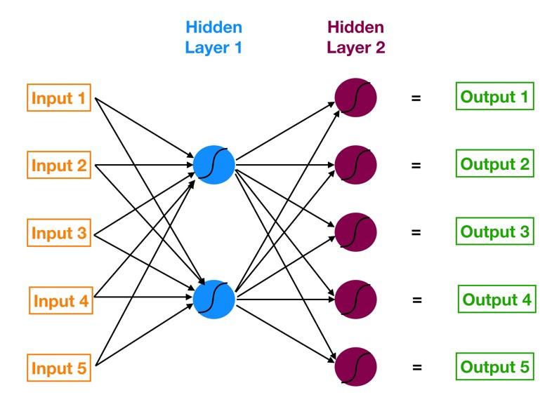

```{r setup, include=FALSE}
knitr::opts_chunk$set(echo = F, comment = "")
```

### Struttura e Tipi di Rete



- **Input layer**: costituito dalle variabili indipendenti (regressori)
- **Hidden layer**: costituito dalle variabili latenti
- **Output layer**: costituito dalle variabili dipendenti (risposta)

(Le variabili categoriali, come al solito, devono essere trasformate in matrici binarie 0-1 con
tante colonne quante sono le modalità)

Ogni layer è formato da n **nodi** (variabili) interconnessi mediante **funzioni di attivazione** 
e **pesi** (weights).

Esistono diverse strutture di una rete neurale, a seconda del task ovvero del tipo di output
che si vuole prevedere. Ad esempio per le serie storiche si utilizzano le reti neurali ricorrenti o LSTM, 
mentre per le immagini si utilizzano le reti neurali convoluzionali.


### Funzione di Costo

L'obiettivo della fase di training di una rete neurale è trovare i valori dei pesi (**w**)
che minimizzano una funzione, detta di **costo** oppure **obiettivo**. Le funzioni di costo
dipendono dal task della rete: in caso di previsione di variabili quantitative la funzione più
utilizzata è quella **quadratica** (MSE - Mean Square Error), invece in ambito di classificazione
si utilizza quella **logaritmica** (Cross-Entropy Loss) nel caso binario e **softmax** nel caso
multinomiale. 

**MSE Loss** $$J(w) = \frac{1}{n}\sum_{i=1}^{n}[y_i - f(x_i,w)]^2$$

**Cross-Entropy Loss** $$J(w) = -\frac{1}{n}\sum_{i=1}^{n}[y_i\log(f(x_i,w)) + (1-y_i)\log(1-f(x_i,w))]$$

### Regolarizzazione

Di solito, per minimizzare il rischio di **overfitting** ossia evitare che la rete si 
adatti "troppo bene" ai dati utilizzati per il training e perda di generalità, si inserisce una
penalità nella funzione di costo. La penalità introduce distorsione nella stima dei pesi 
restringendo lo spazio entro il quale possono essere valutati. Ci sono due tipi principali di
penalità:

- **L1-Norm**: la somma dei valori assoluti dei pesi deve essere minore di un certo s 
$(\sum_{j=1}^{p}|w_j| < s)$

$$J(w)^* = \frac{1}{n}\sum_{i=1}^{n}[y_i - f(x_i,w)]^2 + \lambda \sum_{j=1}^{p}|w_j|$$

- **L2-Norm**: la somma dei quadrati dei pesi deve essere minore di un certo s
$(\sum_{j=1}^{p}w_j^2 < s)$

$$J(w)^* = \frac{1}{n}\sum_{i=1}^{n}[y_i - f(x_i,w)]^2 + \lambda \sum_{j=1}^{p}w_j^2$$

$\lambda$ è detto **weight decay** e definisce la "forza" della penalità: se $\lambda \to \infty$ allora 
$s \to 0$ ($w \to 0$); se $\lambda \to 0$ allora $s \to \infty$ ($w \to OLS$).

### Funzioni di Attivazione

### Aggiornamento Weights

$$w_j^{(t+1)} = w_j^{(t)} - \eta \frac{\partial{J(w)}}{\partial{w_j}} Optimizer - \lambda \eta w_j^{(t)}$$

- $w_j^{(t)}$: peso j-esimo al tempo t 

- $\eta$: learning rate 
    
- $\frac{\partial{J(w)}}{\partial{w_j}}$: derivata parziale prima della funzione di costo (non penalizzata) rispetto a $w_j$
    
- $Optimizer$: algoritmo di ottimizzazione del gradient-descent (momentum, adam, adagrad)

- $\lambda$: weight decay 


### Back-Propagation

### Ottimizzatori

### Iperparametri


